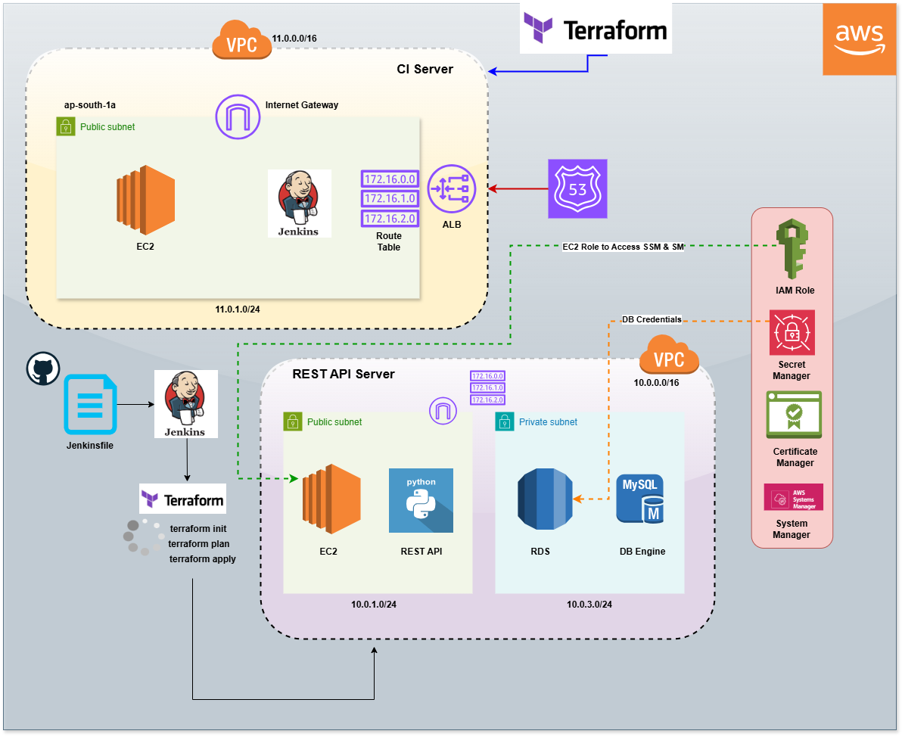

# Terraform AWS Infrastructure Automation with Jenkins

## 📌 Overview
This project demonstrates a **two-stage infrastructure automation workflow** using **Terraform, AWS, and Jenkins**.

- **Stage 1** provisions the foundational infrastructure and sets up **Jenkins as a CI server** on an EC2 instance.
- **Stage 2** uses the Jenkins pipeline created in Stage 1 to provision **application infrastructure**, including a **Python REST API**, **RDS MySQL**, and supporting AWS resources.

The project follows **Infrastructure as Code (IaC)** and **least-privilege security principles**, using **IAM roles, Secrets Manager, and SSM Parameter Store**.

---

## 🏗️ Architecture Overview

### Stage 1 – CI Infrastructure Setup
Provisioned using Terraform:
- VPC
- Public subnets
- Internet Gateway
- Security Groups
- Application Load Balancer (ALB)
- Target Group
- Route 53 DNS records
- EC2 instance
- Jenkins installation via user data

Purpose:
> To create a reusable **CI/CD platform** capable of provisioning and managing AWS infrastructure.

---

### Stage 2 – Application Infrastructure (Triggered by Jenkins)
Provisioned via **Jenkins Pipeline + Terraform**:
- Separate VPC
- Public & private subnets
- NAT Gateway
- Security Groups
- Application Load Balancer
- Target Group
- EC2 instance hosting Python REST API
- RDS MySQL (private subnets)
- IAM Role for EC2
- AWS Secrets Manager (DB credentials)
- AWS SSM Parameter Store (DB endpoint & config)

Purpose:
> To deploy a **secure, production-like application environment** using automated pipelines.

---

## 🔁 CI/CD Workflow

1. Developer triggers Jenkins job
2. Jenkins pulls Terraform infrastructure repository
3. Jenkins executes Terraform commands based on input parameter:
   - `plan`
   - `apply`
   - `destroy`
4. Terraform provisions or destroys AWS infrastructure
5. EC2 instances assume IAM roles for secure access to:
   - AWS Secrets Manager
   - AWS SSM Parameter Store

---

## 🧰 Technology Stack

| Tool | Purpose |
|----|----|
Terraform | Infrastructure as Code |
AWS | Cloud infrastructure |
Jenkins | CI/CD automation |
Python | REST API |
MySQL (RDS) | Relational database |
Route 53 | DNS management |
IAM | Secure access control |
SSM Parameter Store | Runtime configuration |
Secrets Manager | Secure credential storage |

---

## 🔐 Security Best Practices Implemented

- No hardcoded secrets
- IAM Roles attached to EC2 instances
- Least-privilege IAM policies
- Database deployed in private subnets
- ALB used for controlled public access
- Secrets stored in AWS Secrets Manager
- Configuration stored in AWS SSM Parameter Store

---

## 📂 Repository Structure

```text
.
├── stage-1-ci-infra/
│   ├── vpc/
│   ├── alb/
│   ├── ec2/
│   ├── route53/
│   ├── security-groups/
│   └── main.tf
│
├── stage-2-app-infra/
│   ├── vpc/
│   ├── alb/
│   ├── ec2/
│   ├── rds/
│   ├── iam/
│   ├── ssm/
│   ├── secrets-manager/
│   └── main.tf
│
├── Jenkinsfile
├── variables.tf
├── terraform.tfvars
└── README.md
