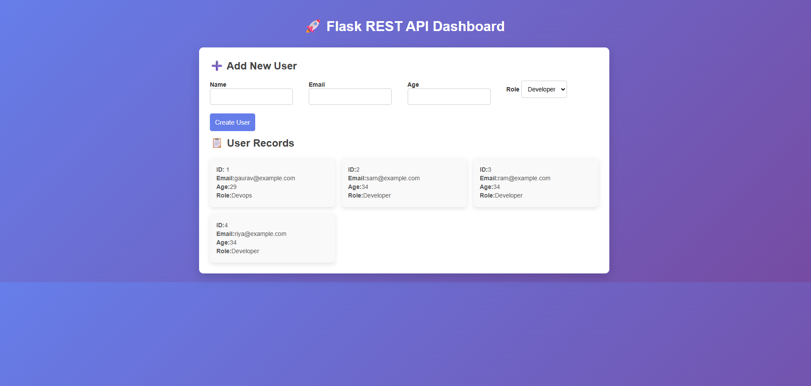

# Flask REST API with AWS RDS (Terraform & Jenkins)

### 📌 Project Overview

This project is a Python Flask REST API that allows users to submit data via a web UI and stores the data securely in an Amazon RDS MySQL database.

The application is designed to run on AWS EC2, with all infrastructure provisioned using Terraform and automated through a Jenkins CI/CD pipeline. Sensitive configuration such as database credentials is managed using AWS Secrets Manager and SSM Parameter Store.

## 🏗️ UI

